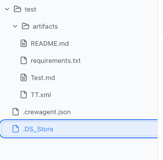

# Bug List

This document is used to track bugs in the project.

## How to add a bug
1. Add a new entry to the "Active Bugs" section.
2. Provide a description.
3. Paste a screenshot if applicable (images will save to `assets/bugs` if your IDE supports it, or put them there manually).
   - *Tip: In VS Code, you can often just paste an image directly into the markdown file and it will ask where to save it.*
4. Set Priority and Status.

---

## Active Bugs

*No active bugs.*

---

## Resolved Bugs

### [BUG-20251230-151739] 文件列表显示错误
- **Status**: ✅ Verified
- **Priority**: Medium
- **Date**: 2025-12-30
- **Resolved**: 2025-12-30
- **Description**:
  把mac 的隐藏文件都显示出来了

- **Resolution**:
  在 `runtimeStore.ts` 的 `buildTreeNode` 方法中添加了隐藏文件过滤逻辑，跳过以 `.` 开头的文件（如 `.DS_Store`, `.git`）。

- **Screenshot**:
  
