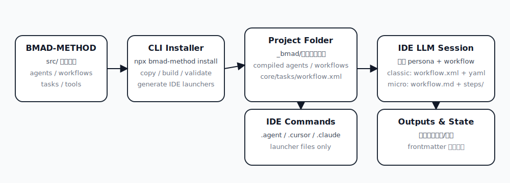
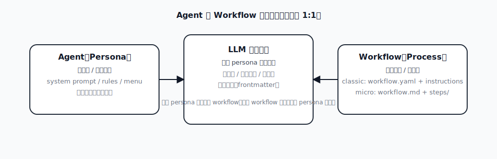
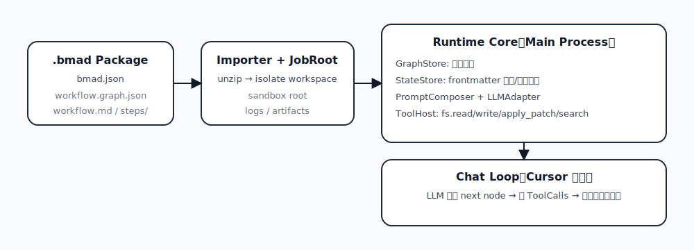

# 报告：BMAD-METHOD 工作流机制与 CrewAgent Runtime 设计建议

本报告聚焦三个问题：

1. **BMAD-METHOD 主要做什么、怎么运行**（尤其是 `workflow.xml` 与 workflows 目录的区别）。  
2. **Cursor/Claude Code 是否存在“专用状态 API”**（结论要落地到 Runtime 设计）。  
3. **为图形化 Builder + if/branch 设计可执行的 `.bmad` 包**（规范包与落地建议）。  

## 1. 结论摘要（先给结论）

- BMAD-METHOD 本质是“**内容仓库 + 安装器**”：把 `src/` 下的 agent/workflow/task/tool 复制/编译到项目 `_bmad/`，并为不同 IDE 生成可加载的命令/规则文件。  
- 工作流有两种来源（并存）：  
  - **经典型**：`workflow.yaml`（配置）+ `instructions.(md|xml)`（步骤），由 `src/core/tasks/workflow.xml` 这套“执行规范”驱动 LLM执行。  
  - **micro-file 型**：`workflow.md`（入口说明）+ `steps/*.md`（分步脚本），执行规范直接写在 Markdown 里，由 LLM按文档规则推进。  
- `.agent/workflows/bmad/` 里的文件不是“工作流本体”，而是 **IDE 命令启动器（launcher）**：  
  - `bmad-*-agents-*.md` 用来“加载某个 agent persona”；  
  - `bmad-*-workflows-*.md` 用来“启动某个 workflow”；  
  二者**不是一一对应**，而是“先选 persona，再跑流程”的组合关系。  
- **Cursor/Claude Code 的 BMAD 集成并没有 `runtime.complete_step` 之类的专用状态 API**：从 BMAD 的安装器/模板可见，状态（frontmatter）更新是通过 IDE 提供的**通用文件编辑工具**完成的。  
  你可以做的“硬实现”是：ToolHost 内部 **原子写入（tmp→rename）+ YAML 可解析校验 + 跳转合法性校验**，而不是强依赖外部 IDE 的扩展 API。  
- 要做图形化 Builder 且支持 if/branch，建议用 **micro-file + 显式图真源**：以 `workflow.graph.json` 为权威、`workflow.md` 为入口与状态、`steps/*.md` 为节点脚本，Runtime 负责校验跳转与沙箱，分支选择交给 LLM（Cursor 风格）。

## 2. `workflow.xml` 与 `workflows/<name>/` 的区别（带例子）

### 2.1 `src/core/tasks/workflow.xml`：执行规范（给 LLM 的“运行时操作系统”）

它不是可执行程序，而是一份写给 LLM 的强约束说明，核心职责是：

- 规定“如何读取 workflow 配置”“如何按顺序执行 instructions”“遇到 template-output 如何停下来”等规则；
- 为 **经典型 workflow** 提供统一的执行框架（解析变量、加载模板/校验清单、处理 `invoke-workflow/goto/if` 等标签）。

在安装到项目后，它位于：`_bmad/core/tasks/workflow.xml`。

### 2.2 `src/**/workflows/<workflow-name>/`：具体流程内容（给 LLM 的“脚本与素材”）

workflow 目录存放“这个流程要做什么”的具体内容，典型两类：

#### A) 经典型（YAML + instructions）

- `workflow.yaml`：变量/路径/输出/配置源等（例如 `config_source`、`instructions`、`validation`）。  
- `instructions.md|instructions.xml`：真正的分步脚本（常用 XML-like 标签包裹）。  
- `checklist.md`：可选的验证/收尾清单。  

例子（来自你当前项目的安装结果）：

- 启动器：`/Users/mengbin/code/GPT/CrewAgent/.agent/workflows/bmad/bmad-bmm-workflows-dev-story.md`  
  它要求先加载 `_bmad/core/tasks/workflow.xml`，再以参数运行 `_bmad/bmm/workflows/4-implementation/dev-story/workflow.yaml`。  
- 配置：`/Users/mengbin/code/GPT/CrewAgent/_bmad/bmm/workflows/4-implementation/dev-story/workflow.yaml`  
- 脚本：该 YAML 中的 `instructions:` 字段指向对应的 `instructions.*` 文件。  

这类 workflow 的“运行决定”主要来自 `workflow.xml` 的通用规则 + instructions 中的显式控制流（如 `invoke-workflow`、`goto`、`if`）。

#### B) micro-file 型（workflow.md + steps/）

- `workflow.md`：入口说明（含初始化/变量/下一步指引）。  
- `steps/*.md`：每一步一个文件，规则写在 Markdown 中，通常要求更新输出文档与 frontmatter。  
- `*-template.md`：可选模板（输出文档骨架）。  

例子：

- 启动器：`/Users/mengbin/code/GPT/CrewAgent/.agent/workflows/bmad/bmad-bmm-workflows-generate-project-context.md`  
  它直接要求加载 `_bmad/bmm/workflows/generate-project-context/workflow.md`（不会走 `workflow.xml`）。  
- 入口：`/Users/mengbin/code/GPT/CrewAgent/_bmad/bmm/workflows/generate-project-context/workflow.md`  
- steps：`/Users/mengbin/code/GPT/CrewAgent/_bmad/bmm/workflows/generate-project-context/steps/step-01-discover.md` 等。  

micro-file 的“执行规范”是分散在各 step 文件里的（例如“禁止跳到下一步直到用户确认”），更适合被 Builder 拆成节点。

## 3. `workflows/<name>/` 下常见文件作用速查

| 文件 | 典型出现于 | 作用 |
|---|---|---|
| `workflow.yaml` | 经典型 | 配置入口：变量解析、instructions/validation/template 路径、输出路径等 |
| `instructions.xml` / `instructions.md` | 经典型 | 分步脚本（可含 `invoke-workflow`、`check if`、`goto` 等） |
| `checklist.md` | 经典型 | 验证清单/收尾（手动或由 LLM 执行） |
| `workflow.md` | micro-file | 入口文档：初始化、规则、从哪个 step 开始 |
| `steps/step-*.md` | micro-file | 每一步的执行脚本与规则（通常要求更新 frontmatter） |
| `*-template.md` / `template.md` | micro-file | 输出文档模板（初次写入骨架） |

## 4. Agent 与 Workflow 的关系（回答“是否一一对应？”）

- **Agent**：persona + 菜单/触发器（“我是谁、我怎么说话、我能做什么”）。  
- **Workflow**：流程脚本（“要做哪几步、产出什么、何时停下来让用户确认”）。  
- 启动器模板里明确写了：执行 workflow 时要“stay in character as current agent persona”。这意味着：  
  - 你可以先激活一个 agent（如 dev），再运行多个 workflows；  
  - 同一个 workflow 也可以在不同 agent persona 下运行（只是产出风格与偏好不同）。  

因此，`.agent/workflows/bmad/` 下的 `agents-*` 与 `workflows-*` 是两套入口，不是 1:1 绑定。

## 5. “frontmatter 只能通过 Runtime API 更新吗？”——结论与推理

结论：**不是**。至少在 BMAD→Cursor/Claude Code 的集成模式下，LLM 更新 frontmatter 走的是通用文件编辑/patch 工具，并没有专用的“状态更新 API”。

推理依据（你本地仓库可直接核对）：

1. Cursor/Antigravity 的安装器只生成 **规则/命令文件**（launcher），不提供任何“完成 step”之类的额外协议：  
   - BMAD-METHOD 模板：`BMAD-METHOD/tools/cli/installers/lib/ide/templates/workflow-command-template.md`  
2. micro-file steps 明确要求“Update frontmatter”，但没有任何可调用的专用工具名，默认就是编辑文件：  
   - 例如：`BMAD-METHOD/src/core/workflows/brainstorming/steps/step-01-session-setup.md`  

因此，CrewAgent Runtime 的正确落点是：

- 默认允许 LLM 通过 `fs.apply_patch/fs.write` 更新 `workflow.md` frontmatter；  
- ToolHost 硬实现：**原子写入 + YAML 校验 +（可选）基于 graph 的跳转合法性校验**；  
- 如需更强一致性，再加 `runtime.update_state/complete_node` 作为“严格模式”。

## 6. 图形化 Builder + if/branch：推荐 `.bmad` v1.1（规范包已落地）

推荐做法是把“分支/跳转”从自然语言里抽出来，放到**可校验的图真源**中：

- `workflow.graph.json`：nodes/edges + `conditionText`（给 LLM 看）+ 可选 `conditionExpr`（给 Runtime 评估）。  
- `workflow.md`：入口说明 + frontmatter 状态（`currentNodeId/stepsCompleted/variables/decisionLog`）。  
- `steps/*.md`：每个 node 一个脚本，写清：目标/产物/变量更新/如何更新 `workflow.md`。  

规范包位置：

- Spec：`crewagent-runtime/spec/bmad-package-spec/v1.1/README.md`  
- Schemas：`crewagent-runtime/spec/bmad-package-spec/v1.1/schemas/`  
- 示例包：`crewagent-runtime/spec/bmad-package-spec/v1.1/examples/hello-branch/`（含分支节点与默认分支）

