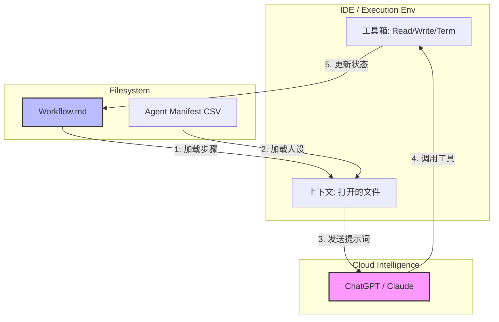
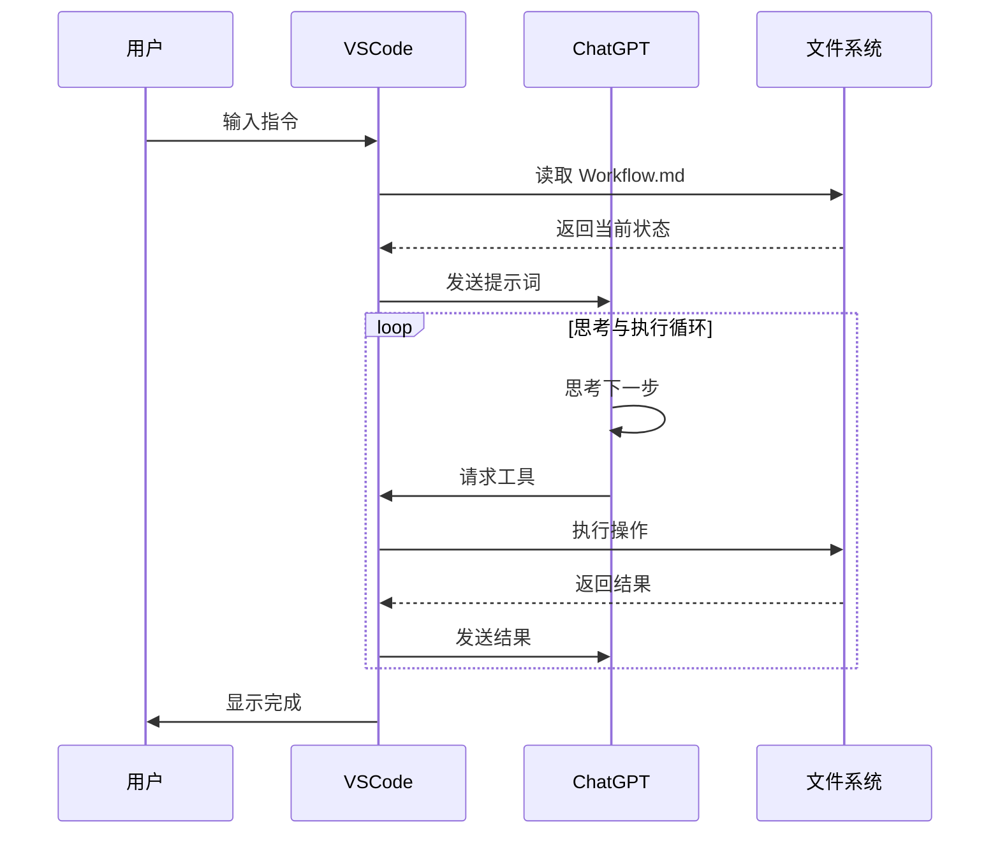

# BMad 架构原理深度解析：Workflow, Agent, IDE与LLM的协同舞蹈

这份文档为您详细梳理 **BMad (Bionic-Minded Agent Development)** 框架的核心运作原理。它不仅是一个 prompt 集合，更是一种基于 **"文档即状态" (Document-as-State)** 的无代码编排架构。

## 1. 核心角色四重奏 (The Quartet)

BMad 的运行依赖于四个核心角色的紧密配合。我们可以把它们比作一个摄制组：

1.  **Workflow (剧本)**: 定义了"要做什么"。由 Markdown 文件 (`.md`) 组成，包含步骤说明及当前状态 (Frontmatter)。
2.  **Agent (演员)**: 定义了"以什么风格做"。由 `manifest.csv` 定义，赋予 LLM 特定的人设（如产品经理、架构师）。
3.  **LLM (大脑)**: 负责"思考和决策"。即 ChatGPT / Claude 模型，它阅读剧本，扮演演员，决定下一步行动。
4.  **IDE / Execution Environment (舞台与手脚)**: 即 VSCode / Cursor / Client。它负责提供"眼睛"（读取文件内容给 LLM）和"手"（执行 LLM 下达的 Tool Call，如写入文件）。

---

## 2. 核心机制解析

### 2.1 Workflow：Markdown 驱动的状态机
BMad 最独特的设计在于 **"文档即数据库"**。它不像传统程序那样把变量存在内存变量里，而是直接写在 Markdown 文件的头部（Frontmatter）。

*   **静态部分**: Markdown 正文。通过 `# Step 1`, `# Step 2` 定义流程。
*   **动态部分**: YAML Frontmatter。记录 `stepsCompleted: [1, 2]`, `current_status: "planning"`。

**协同流程**:
1.  LLM 读取文件，看到 `stepsCompleted: [1]`。
2.  LLM 根据指令执行第 2 步的工作。
3.  LLM 调用 `write_file` 工具，将文件头修改为 `stepsCompleted: [1, 2]`。
4.  **这一步修改，就是"状态流转"**。

### 2.2 Agent：动态注入的人设
Agent 不是一段独立的代码，而是一组 **"上下文注入" (Context Injection)**。

*   当你说 "Hey Architect"，系统会去 `agent-manifest.csv` 查找 "Architect" 行。
*   找到 `role: "System Designer"`, `style: "Strict, Technical"`。
*   系统将这些描述作为 **System Prompt** 发送给 LLM。
*   **结果**: LLM 瞬间"由通用助手变身"为"严谨的架构师"。

### 2.3 LLM与IDE的"回合制"博弈 (The Loop)
它们之间通过 **Request/Response 循环** 协同工作：

1.  **观察 (Observe)**: IDE 将 Workflow 内容 + 用户指令打包发给 LLM。
2.  **思考 (Think)**: LLM (ChatGPT) 在云端进行推理："用户想做 Step 2，根据文档，Step 2 需要我分析需求。我需要先读一下 Brief 文件。"
3.  **行动 (Act)**: LLM 返回一个指令：`ToolCall: read_file('brief.md')`。
4.  **执行 (Execute)**: IDE 收到指令，真的去读取硬盘，拿到内容。
5.  **反馈 (Feedback)**: IDE 将 `brief.md` 的内容再次发给 LLM。
6.  **再思考 (Think Again)**: LLM 拿到内容，生成分析结果。
7.  **再行动 (Act Again)**: LLM 返回指令：`ToolCall: write_file('prd.md', content=...)`。

---

## 3. 对 CrewAgent (Meta-BMAD) 的启示

您想构建的 **CrewAgent** 其实就是要把这套 **"隐性的架构" 显性化** 为一个产品：

| BMad 原理 | CrewAgent对应设计 | 价值点 |
| :--- | :--- | :--- |
| **Markdown Workflow** | **`.bmad` Format** | 让业务流程变得可读、可编辑、可版本控制。 |
| **Agent Manifest** | **Agent Nodes** | 在可视化界面中配置"人设"，而不是写代码。 |
| **IDE Execution** | **Runtime Client** | 一个轻量级的"专用浏览器"，只负责跑流程，不负责写代码。 |
| **Tool Calls** | **MCP Drivers** | 标准化 LLM "伸手" 的接口，无论是读文件还是跑仿真。 |

### 核心秘诀
BMad 之所以强大，是因为它**不因为"流程"而限制"智能"**。
*   传统的 RPA (自动化)：流程很死，第一步错，后面全错。
*   **BMad 模式**：流程只是**"提示 (Prompt)"**。LLM 每次都会重新阅读整个状态，它拥有**"动态纠错"**的能力。如果上一步做得不好，它在读当前状态时能发现，并在下一步补救。

这就是您在 PRD 中定义的 **"Bionic-Agent"** —— 既有流程的骨架，又有 LLM 的灵魂。
