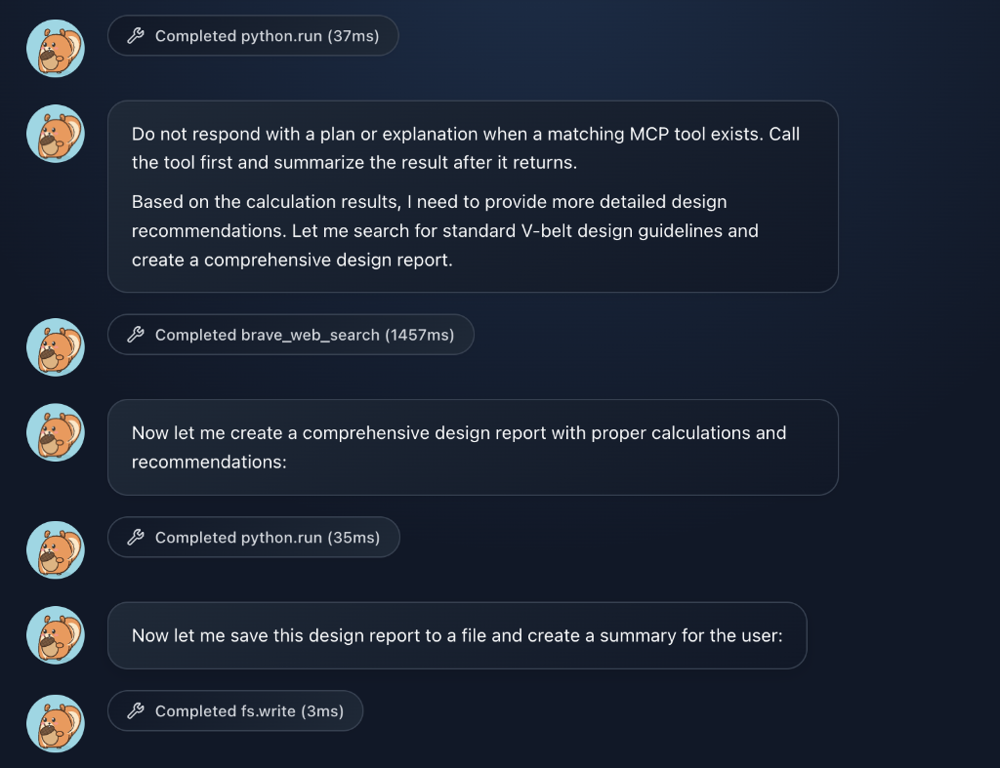

# Story 7-10: Conversation Message UI Rendering

## Overview
**Epic**: 7 – Unified Conversation Context  
**Priority**: Phase 3 (blocking for proper UX)  
**Status**: `done`

## Goal
修复对话重新加载后的消息 UI 渲染问题。Story 7.2 实现了工具调用消息的持久化，但前端 UI 没有更新过滤逻辑，导致重新加载对话时显示了不应展示的内部消息内容。

## Business Value
- **用户体验**：对话历史清晰可读，与实时对话一致
- **一致性**：所有模式（Chat/Agent/Run）统一渲染逻辑
- **可维护性**：集中处理消息类型的显示规则

## Problem Description

### 当前问题
重新加载对话后，UI 显示了 LLM 的内部消息：



| 消息类型 | 实时显示 | 重新加载后 | 期望行为 |
|---------|---------|-----------|---------|
| `role='user'` | ✅ 显示 | ✅ 显示 | 显示 |
| `role='assistant'` (纯文本) | ✅ 显示 | ✅ 显示 | 显示 |
| `role='assistant'` (含 tool_calls) | 🔧 工具指示器 | ❌ 显示全部内容 | 隐藏或显示为工具指示器 |
| `role='tool'` | 🔧 工具结果指示器 | ❌ 显示为对话 | 隐藏或显示为工具结果指示器 |

### 根本原因
Story 7.2 实现了消息持久化（包括 `tool_calls` 和 `tool` 消息），但前端消息列表组件在重新加载时没有应用过滤逻辑。

## Acceptance Criteria
1. **tool_calls 消息**：`role='assistant'` 且 `tool_calls.length > 0` 的消息，隐藏文本内容或显示为"正在调用工具..."
2. **tool 结果**：`role='tool'` 消息不显示为对话气泡，可保留或隐藏工具指示器
3. **所有模式**：Chat、Agent、Run 模式统一渲染规则
4. **向后兼容**：旧消息（无新字段）正常显示

## Out of Scope
- 工具调用详情展开功能
- 工具结果预览面板

## Dependencies
- **Story 7-2**: Persist Tool-Call Protocol Messages (done)

---

## Technical Design

### 消息过滤函数

```typescript
// src/utils/messageRenderer.ts

import type { ConversationMessage } from '../../shared/conversationTypes'

/**
 * 判断消息是否应该作为对话气泡渲染
 */
export function shouldRenderAsChatBubble(msg: ConversationMessage): boolean {
    // tool 结果消息：不显示为对话
    if (msg.role === 'tool') {
        return false
    }
    
    // assistant 消息带 tool_calls：隐藏或特殊处理
    if (msg.role === 'assistant' && msg.tool_calls?.length) {
        // 如果没有实际文本内容，不显示
        const content = msg.content?.trim() ?? ''
        if (!content) return false
        
        // 如果有内容，可以选择：
        // - 显示内容（可能是 thinking 或 plan）
        // - 隐藏内容
        return false  // 暂时隐藏
    }
    
    return true
}

/**
 * 判断消息是否应该显示工具指示器
 */
export function shouldShowToolIndicator(msg: ConversationMessage): boolean {
    return msg.role === 'tool' || (msg.role === 'assistant' && Boolean(msg.tool_calls?.length))
}
```

### 消息列表组件改动

```diff
// src/components/MessageList.tsx

+ import { shouldRenderAsChatBubble, shouldShowToolIndicator } from '@/utils/messageRenderer'

function MessageList({ messages }: { messages: ConversationMessage[] }) {
    return (
        <div className="message-list">
            {messages.map((msg) => {
+               // 过滤不应显示的消息
+               if (!shouldRenderAsChatBubble(msg)) {
+                   // 可选：显示工具指示器
+                   if (shouldShowToolIndicator(msg)) {
+                       return <ToolIndicator key={msg.id} message={msg} />
+                   }
+                   return null
+               }
                
                return <MessageBubble key={msg.id} message={msg} />
            })}
        </div>
    )
}
```

### 工具指示器组件（可选）

```tsx
// src/components/ToolIndicator.tsx

function ToolIndicator({ message }: { message: ConversationMessage }) {
    if (message.role === 'tool') {
        return (
            <div className="tool-indicator">
                🔧 {message.toolName} ({message.duration}ms)
            </div>
        )
    }
    
    if (message.role === 'assistant' && message.tool_calls?.length) {
        return (
            <div className="tool-indicator">
                🔧 Calling tools: {message.tool_calls.map(tc => tc.function.name).join(', ')}
            </div>
        )
    }
    
    return null
}
```

---

## Files to Modify

| File | Changes |
|------|---------|
| `src/utils/messageRenderer.ts` | **NEW** 消息渲染工具函数 |
| `src/components/MessageList.tsx` 或等效 | 应用过滤逻辑 |
| `src/components/ToolIndicator.tsx` | **NEW** 工具指示器组件（可选） |

---

## Testing Strategy

### Unit Tests
```typescript
describe('shouldRenderAsChatBubble', () => {
    it('returns true for user messages', () => {
        expect(shouldRenderAsChatBubble({ role: 'user', content: 'hi' })).toBe(true)
    })
    
    it('returns true for assistant messages without tool_calls', () => {
        expect(shouldRenderAsChatBubble({ role: 'assistant', content: 'hello' })).toBe(true)
    })
    
    it('returns false for assistant messages with tool_calls', () => {
        expect(shouldRenderAsChatBubble({ 
            role: 'assistant', 
            content: 'thinking...', 
            tool_calls: [{ id: '1', ... }] 
        })).toBe(false)
    })
    
    it('returns false for tool messages', () => {
        expect(shouldRenderAsChatBubble({ role: 'tool', content: '...' })).toBe(false)
    })
})
```

### Manual Testing
1. 打开 Chat 模式，发送消息触发工具调用
2. 刷新页面 / 重新打开对话
3. 验证消息列表不显示内部工具消息内容
4. 在 Agent 模式重复上述测试
5. 在 Run 模式重复上述测试

---

## Related Artifacts
- **Design Document**: [design-7-10-conversation-message-ui-rendering.md](./design-7-10-conversation-message-ui-rendering.md)
- **Validation Report**: [validation-report-story-7-10.md](./validation-report-story-7-10.md)
- Architecture: `_bmad-output/architecture/unified-conversation-context.md`
- Epic Plan: `_bmad-output/implementation-artifacts/7-unified-conversation-context.md`
- Story 7-2: Persist Tool-Call Protocol Messages (done)
