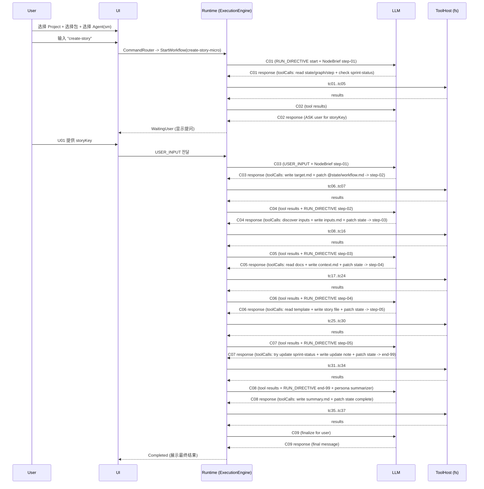

# Create-Story（micro-file+graph）理想交互全流程（时序图 + JSON Trace）

> 本文基于示例包：`crewagent-runtime/spec/bmad-package-spec/v1.1/examples/create-story-micro/`  
> 目的：用“理想情况下”的方式，把 **RUN_DIRECTIVE(start) → 自动跑 → 需要输入时 USER_INPUT → 继续跑完** 的全过程，按顺序用 JSON 精确描述出来。

---

## 0) 场景假设（为了让 trace 可读、可复现）

- 入口：Agent-First（用户先选 `sm` agent，在菜单/输入框中输入 `create-story`）。
- 本次 run 采用 **autopilot=true**：除非缺必要输入，否则不向用户停下来确认中间产物。
- 项目内文档存在情况（用于演示“只在必要时问用户”）：
  - ✅ `@project/artifacts/epics.md`
  - ✅ `@project/artifacts/PRD.md`
  - ✅ `@project/artifacts/architecture.md`
  - ✅ `@project/artifacts/ux.md`
  - ✅ `@project/project-context.md`
  - ❌ `@project/artifacts/sprint-status.yaml`（因此 Step-01 会问用户 storyKey）
- 用户在首次提问时提供：`1-2-user-authentication`

> 注意：`@state/workflow.md` 存在于 RuntimeStore（用户不可见），但通过 mount `@state` 供 LLM 读写；产物写入 `@project/artifacts/`（用户可见）。

---

## 1) Runtime ↔ LLM 时序图（每次对话已标号）



---

## 2) 全量 JSON Trace（按顺序）

> 说明：
> - 这是“理想执行脚本”，用于指导你实现 ExecutionEngine + PromptComposer + ToolHost。
> - tool result 里使用 `contentPreview/entriesPreview` 是为了表达“默认不回传全文”（会被 maxReadBytes 截断）；真实实现可按文件大小决定返回 `content` 或 `contentPreview + truncated`。
> - Runtime 为 UI/校验而做的“内部读”（例如解析 state、校验 graph）不一定会出现在 trace 里；trace 只强调 LLM 可见的对话与 toolCall 循环。
> - 这里的 `fs.apply_patch` 用“结构化 frontmatter 更新操作”表达（便于阅读）；你实现时可映射成 diff patch 或专用 state API。
> - 所有路径均使用 mount alias（`@project/@pkg/@state`），避免泄露真实文件系统路径。

```json
{
  "traceVersion": "crewagent.runtime.llm.trace.v1",
  "workflow": {
    "packageExample": "crewagent-runtime/spec/bmad-package-spec/v1.1/examples/create-story-micro/",
    "workflowType": "create-story-micro",
    "graphPath": "@pkg/workflow.graph.json",
    "statePath": "@state/workflow.md",
    "artifactsRoot": "@project/artifacts/"
  },
  "assumptions": {
    "entrypoint": "Agent-First",
    "autopilot": true,
    "missingSprintStatus": true,
    "userProvidesStoryKey": "1-2-user-authentication",
    "projectFilesExist": [
      "@project/artifacts/epics.md",
      "@project/artifacts/PRD.md",
      "@project/artifacts/architecture.md",
      "@project/artifacts/ux.md",
      "@project/project-context.md"
    ]
  },
  "templates": {
    "SYSTEM_BASE_RUNTIME_RULES": "You are running a CrewAgent v1.1 micro-file workflow.\n\nMounts:\n- @project: user project (read/write). Default artifacts root is @project/artifacts/.\n- @pkg: package content (read-only).\n- @state: run state (read/write, user-invisible). Workflow state file is @state/workflow.md.\n\nRules:\n- workflow.graph.json is the source of truth for allowed transitions.\n- Always follow the current node's step file instructions before writing artifacts/state.\n- After completing a node, update @state/workflow.md frontmatter: stepsCompleted, currentNodeId, variables (if needed), decisionLog (if decision), artifacts, updatedAt.\n- Autopilot: continue automatically until you need user input or workflow ends.\n- Do not write to @pkg. Do not reveal real filesystem paths; only use mount paths.\n",
    "SYSTEM_TOOL_POLICY_SM": "Tool policy:\n- fs: enabled (maxReadBytes=524288, maxWriteBytes=2097152)\n- mcp: disabled\nPrefer fs.apply_patch for edits. All writes must be under @project or @state.\n",
    "SYSTEM_PERSONA_SM": "You are Bob (Scrum Master).\nCommunication style: Crisp and checklist-driven. Default to autopilot; only ask when required inputs are missing.\nMission: Create developer-ready story context with exhaustive guardrails to prevent implementation mistakes.\n",
    "SYSTEM_PERSONA_SUMMARIZER": "You are Sam (Summarizer).\nOutput short bullet lists: artifacts produced + next actions.\n"
  },
  "toolsAvailable": ["fs.read", "fs.list", "fs.search", "fs.write", "fs.apply_patch"],
  "dialogues": [
    {
      "id": "C01",
      "phaseBefore": "RunMode.Running",
      "request": {
        "messages": [
          { "role": "system", "templateRef": "SYSTEM_BASE_RUNTIME_RULES" },
          { "role": "system", "templateRef": "SYSTEM_TOOL_POLICY_SM" },
          { "role": "system", "templateRef": "SYSTEM_PERSONA_SM" },
          {
            "role": "user",
            "content": "RUN_DIRECTIVE\n- runType: bmad-micro\n- intent: start\n- workflow: create-story-micro\n- state: @state/workflow.md\n- graph: @pkg/workflow.graph.json\n- artifactsRoot: @project/artifacts/\n- currentNodeId: step-01-select-story\n- effectiveAgentId: sm\n- autopilot: true\n"
          },
          {
            "role": "user",
            "content": "Node brief:\n- currentNodeId: step-01-select-story\n- step file: @pkg/steps/step-01-select-story.md\n- outputs map: artifacts/create-story/target.md -> @project/artifacts/create-story/target.md\n- allowed next: step-02-discover-inputs (label=next)\n"
          }
        ],
        "tools": ["fs.read", "fs.list", "fs.search", "fs.write", "fs.apply_patch"]
      },
      "response": {
        "assistant": {
          "role": "assistant",
          "content": "",
          "toolCalls": [
            { "id": "tc01", "name": "fs.read", "arguments": { "path": "@state/workflow.md" } },
            { "id": "tc02", "name": "fs.read", "arguments": { "path": "@pkg/workflow.graph.json" } },
            { "id": "tc03", "name": "fs.read", "arguments": { "path": "@pkg/steps/step-01-select-story.md" } },
            { "id": "tc04", "name": "fs.list", "arguments": { "path": "@project/artifacts" } },
            { "id": "tc05", "name": "fs.read", "arguments": { "path": "@project/artifacts/sprint-status.yaml" } }
          ]
        }
      },
      "runtime": {
        "toolRuns": [
          {
            "toolCallId": "tc01",
            "result": {
              "ok": true,
              "contentPreview": "---\\nschemaVersion: \"1.1\"\\nworkflowType: \"create-story-micro\"\\ncurrentNodeId: \"step-01-select-story\"\\nstepsCompleted: []\\nvariables: {}\\ndecisionLog: []\\nartifacts: []\\n---\\n..."
            }
          },
          {
            "toolCallId": "tc02",
            "result": { "ok": true, "contentPreview": "{ \"entryNodeId\": \"step-01-select-story\", \"nodes\": [...], \"edges\": [...] }" }
          },
          {
            "toolCallId": "tc03",
            "result": { "ok": true, "contentPreview": "---\\nnodeId: step-01-select-story\\n...\\nInstructions: ...\\n" }
          },
          {
            "toolCallId": "tc04",
            "result": {
              "ok": true,
              "entriesPreview": ["epics.md", "PRD.md", "architecture.md", "ux.md", "create-story/"]
            }
          },
          {
            "toolCallId": "tc05",
            "result": { "ok": false, "error": { "code": "ENOENT", "message": "File not found: @project/artifacts/sprint-status.yaml" } }
          }
        ],
        "uiAfter": { "phase": "RunMode.Running", "reason": "toolCalls_executed_continue_loop" }
      }
    },
    {
      "id": "C02",
      "phaseBefore": "RunMode.Running",
      "request": {
        "messages": [
          { "role": "system", "templateRef": "SYSTEM_BASE_RUNTIME_RULES" },
          { "role": "system", "templateRef": "SYSTEM_TOOL_POLICY_SM" },
          { "role": "system", "templateRef": "SYSTEM_PERSONA_SM" },
          { "role": "user", "content": "(tool results from tc01..tc05 are available to you; sprint-status is missing)" }
        ],
        "tools": ["fs.read", "fs.list", "fs.search", "fs.write", "fs.apply_patch"]
      },
      "response": {
        "assistant": {
          "role": "assistant",
          "content": "未发现 sprint-status.yaml，且当前未指定要生成的 story。\n\n请提供要生成的 story key（例如：`1-2-user-authentication`）。",
          "toolCalls": []
        }
      },
      "runtime": {
        "uiAfter": {
          "phase": "RunMode.WaitingUser",
          "stopReason": "assistant_no_toolCalls_and_not_complete",
          "displayToUser": true
        }
      }
    },
    {
      "id": "U01",
      "type": "user_input",
      "uiToRuntime": {
        "rawText": "1-2-user-authentication",
        "wrappedMessage": "USER_INPUT\\n- forNodeId: step-01-select-story\\n1-2-user-authentication"
      }
    },
    {
      "id": "C03",
      "phaseBefore": "RunMode.Running",
      "request": {
        "messages": [
          { "role": "system", "templateRef": "SYSTEM_BASE_RUNTIME_RULES" },
          { "role": "system", "templateRef": "SYSTEM_TOOL_POLICY_SM" },
          { "role": "system", "templateRef": "SYSTEM_PERSONA_SM" },
          {
            "role": "user",
            "content": "RUN_DIRECTIVE\\n- runType: bmad-micro\\n- intent: continue\\n- workflow: create-story-micro\\n- state: @state/workflow.md\\n- graph: @pkg/workflow.graph.json\\n- artifactsRoot: @project/artifacts/\\n- currentNodeId: step-01-select-story\\n- effectiveAgentId: sm\\n- autopilot: true\\n"
          },
          {
            "role": "user",
            "content": "USER_INPUT\\n- forNodeId: step-01-select-story\\n1-2-user-authentication"
          },
          {
            "role": "user",
            "content": "Reminder: Step-01 requires writing @project/artifacts/create-story/target.md and then patching @state/workflow.md (stepsCompleted, variables, currentNodeId -> step-02-discover-inputs, artifacts append, updatedAt)."
          }
        ],
        "tools": ["fs.read", "fs.list", "fs.search", "fs.write", "fs.apply_patch"]
      },
      "response": {
        "assistant": {
          "role": "assistant",
          "content": "",
          "toolCalls": [
            {
              "id": "tc06",
              "name": "fs.write",
              "arguments": {
                "path": "@project/artifacts/create-story/target.md",
                "content": "# Target Story\\n\\n- storyKey: 1-2-user-authentication\\n- epicNum: 1\\n- storyNum: 2\\n- storyTitle: user-authentication\\n- sprintStatusPath: (not found)\\n- selectionReason: user provided story key\\n"
              }
            },
            {
              "id": "tc07",
              "name": "fs.apply_patch",
              "arguments": {
                "path": "@state/workflow.md",
                "operation": "updateFrontmatter",
                "update": {
                  "stepsCompleted": { "append": ["step-01-select-story"] },
                  "variables": {
                    "set": {
                      "storyKey": "1-2-user-authentication",
                      "epicNum": "1",
                      "storyNum": "2",
                      "storyTitle": "user-authentication",
                      "sprintStatusPath": ""
                    }
                  },
                  "currentNodeId": { "set": "step-02-discover-inputs" },
                  "artifacts": { "append": ["artifacts/create-story/target.md"] },
                  "updatedAt": { "set": "2025-12-25T00:00:00Z" }
                }
              }
            }
          ]
        }
      },
      "runtime": {
        "toolRuns": [
          { "toolCallId": "tc06", "result": { "ok": true, "bytesWritten": 196, "path": "@project/artifacts/create-story/target.md" } },
          {
            "toolCallId": "tc07",
            "result": {
              "ok": true,
              "stateFrontmatterAfter": {
                "currentNodeId": "step-02-discover-inputs",
                "stepsCompleted": ["step-01-select-story"],
                "variables": {
                  "storyKey": "1-2-user-authentication",
                  "epicNum": "1",
                  "storyNum": "2",
                  "storyTitle": "user-authentication",
                  "sprintStatusPath": ""
                },
                "artifactsAppended": ["artifacts/create-story/target.md"]
              }
            }
          }
        ],
        "uiAfter": { "phase": "RunMode.Running", "reason": "state_updated_to_next_node_autopilot" }
      }
    },
    {
      "id": "C04",
      "phaseBefore": "RunMode.Running",
      "request": {
        "messages": [
          { "role": "system", "templateRef": "SYSTEM_BASE_RUNTIME_RULES" },
          { "role": "system", "templateRef": "SYSTEM_TOOL_POLICY_SM" },
          { "role": "system", "templateRef": "SYSTEM_PERSONA_SM" },
          {
            "role": "user",
            "content": "RUN_DIRECTIVE\\n- runType: bmad-micro\\n- intent: continue\\n- workflow: create-story-micro\\n- state: @state/workflow.md\\n- graph: @pkg/workflow.graph.json\\n- artifactsRoot: @project/artifacts/\\n- currentNodeId: step-02-discover-inputs\\n- effectiveAgentId: sm\\n- autopilot: true\\n"
          },
          {
            "role": "user",
            "content": "Node brief:\\n- step file: @pkg/steps/step-02-discover-inputs.md\\n- outputs map: artifacts/create-story/inputs.md -> @project/artifacts/create-story/inputs.md\\n- required: find epicsPath (must exist)\\n- allowed next: step-03-extract-context\\n"
          }
        ],
        "tools": ["fs.read", "fs.list", "fs.search", "fs.write", "fs.apply_patch"]
      },
      "response": {
        "assistant": {
          "role": "assistant",
          "content": "",
          "toolCalls": [
            { "id": "tc08", "name": "fs.read", "arguments": { "path": "@pkg/steps/step-02-discover-inputs.md" } },
            { "id": "tc09", "name": "fs.list", "arguments": { "path": "@project/artifacts" } },
            { "id": "tc10", "name": "fs.read", "arguments": { "path": "@project/artifacts/epics.md" } },
            { "id": "tc11", "name": "fs.read", "arguments": { "path": "@project/artifacts/PRD.md" } },
            { "id": "tc12", "name": "fs.read", "arguments": { "path": "@project/artifacts/architecture.md" } },
            { "id": "tc13", "name": "fs.read", "arguments": { "path": "@project/artifacts/ux.md" } },
            { "id": "tc14", "name": "fs.read", "arguments": { "path": "@project/project-context.md" } },
            {
              "id": "tc15",
              "name": "fs.write",
              "arguments": {
                "path": "@project/artifacts/create-story/inputs.md",
                "content": "# Inputs\\n\\n- storyKey: 1-2-user-authentication\\n\\n## Found\\n- epics: artifacts/epics.md\\n- prd: artifacts/PRD.md\\n- architecture: artifacts/architecture.md\\n- ux: artifacts/ux.md\\n- project-context: project-context.md\\n\\n## Missing\\n- sprint-status: artifacts/sprint-status.yaml (not found)\\n"
              }
            },
            {
              "id": "tc16",
              "name": "fs.apply_patch",
              "arguments": {
                "path": "@state/workflow.md",
                "operation": "updateFrontmatter",
                "update": {
                  "stepsCompleted": { "append": ["step-02-discover-inputs"] },
                  "variables": {
                    "set": {
                      "epicsPath": "artifacts/epics.md",
                      "prdPath": "artifacts/PRD.md",
                      "architecturePath": "artifacts/architecture.md",
                      "uxPath": "artifacts/ux.md",
                      "projectContextPath": "project-context.md"
                    }
                  },
                  "currentNodeId": { "set": "step-03-extract-context" },
                  "artifacts": { "append": ["artifacts/create-story/inputs.md"] },
                  "updatedAt": { "set": "2025-12-25T00:00:00Z" }
                }
              }
            }
          ]
        }
      },
      "runtime": {
        "toolRuns": [
          { "toolCallId": "tc08", "result": { "ok": true, "contentPreview": "---\\nnodeId: step-02-discover-inputs\\n...\\n" } },
          { "toolCallId": "tc09", "result": { "ok": true, "entriesPreview": ["epics.md", "PRD.md", "architecture.md", "ux.md", "create-story/"] } },
          { "toolCallId": "tc10", "result": { "ok": true, "bytes": 120000, "contentPreview": "# Epics\\n... (truncated)" } },
          { "toolCallId": "tc11", "result": { "ok": true, "bytes": 90000, "contentPreview": "# PRD\\n... (truncated)" } },
          { "toolCallId": "tc12", "result": { "ok": true, "bytes": 110000, "contentPreview": "# Architecture\\n... (truncated)" } },
          { "toolCallId": "tc13", "result": { "ok": true, "bytes": 60000, "contentPreview": "# UX\\n... (truncated)" } },
          { "toolCallId": "tc14", "result": { "ok": true, "bytes": 20000, "contentPreview": "# Project Context\\n... (truncated)" } },
          { "toolCallId": "tc15", "result": { "ok": true, "bytesWritten": 307, "path": "@project/artifacts/create-story/inputs.md" } },
          {
            "toolCallId": "tc16",
            "result": {
              "ok": true,
              "stateFrontmatterAfter": {
                "currentNodeId": "step-03-extract-context",
                "stepsCompletedAppended": ["step-02-discover-inputs"],
                "variablesUpdated": ["epicsPath", "prdPath", "architecturePath", "uxPath", "projectContextPath"],
                "artifactsAppended": ["artifacts/create-story/inputs.md"]
              }
            }
          }
        ],
        "uiAfter": { "phase": "RunMode.Running", "reason": "state_updated_to_next_node_autopilot" }
      }
    },
    {
      "id": "C05",
      "phaseBefore": "RunMode.Running",
      "request": {
        "messages": [
          { "role": "system", "templateRef": "SYSTEM_BASE_RUNTIME_RULES" },
          { "role": "system", "templateRef": "SYSTEM_TOOL_POLICY_SM" },
          { "role": "system", "templateRef": "SYSTEM_PERSONA_SM" },
          {
            "role": "user",
            "content": "RUN_DIRECTIVE\\n- runType: bmad-micro\\n- intent: continue\\n- workflow: create-story-micro\\n- state: @state/workflow.md\\n- graph: @pkg/workflow.graph.json\\n- artifactsRoot: @project/artifacts/\\n- currentNodeId: step-03-extract-context\\n- effectiveAgentId: sm\\n- autopilot: true\\n"
          },
          {
            "role": "user",
            "content": "Node brief:\\n- step file: @pkg/steps/step-03-extract-context.md\\n- outputs map: artifacts/create-story/context.md -> @project/artifacts/create-story/context.md\\n- must read: artifacts/epics.md (via variables.epicsPath)\\n- allowed next: step-04-generate-story\\n"
          }
        ],
        "tools": ["fs.read", "fs.list", "fs.search", "fs.write", "fs.apply_patch"]
      },
      "response": {
        "assistant": {
          "role": "assistant",
          "content": "",
          "toolCalls": [
            { "id": "tc17", "name": "fs.read", "arguments": { "path": "@pkg/steps/step-03-extract-context.md" } },
            { "id": "tc18", "name": "fs.read", "arguments": { "path": "@project/artifacts/epics.md" } },
            { "id": "tc19", "name": "fs.read", "arguments": { "path": "@project/artifacts/PRD.md" } },
            { "id": "tc20", "name": "fs.read", "arguments": { "path": "@project/artifacts/architecture.md" } },
            { "id": "tc21", "name": "fs.read", "arguments": { "path": "@project/artifacts/ux.md" } },
            { "id": "tc22", "name": "fs.read", "arguments": { "path": "@project/project-context.md" } },
            {
              "id": "tc23",
              "name": "fs.write",
              "arguments": {
                "path": "@project/artifacts/create-story/context.md",
                "content": "# Story Context Extract\\n\\n## Story foundation\\n- storyKey: 1-2-user-authentication\\n- user story: (from epics)\\n- acceptance criteria: (from epics)\\n\\n## Developer guardrails\\n- tech stack + versions: (from architecture/project-context)\\n- file structure rules: (from project-context)\\n- testing standards: (from architecture)\\n\\n## References\\n- artifacts/epics.md#Epic-1 (example)\\n- artifacts/architecture.md#Auth (example)\\n- project-context.md#Conventions (example)\\n\\n## Open questions\\n- (empty if none)\\n"
              }
            },
            {
              "id": "tc24",
              "name": "fs.apply_patch",
              "arguments": {
                "path": "@state/workflow.md",
                "operation": "updateFrontmatter",
                "update": {
                  "stepsCompleted": { "append": ["step-03-extract-context"] },
                  "variables": { "set": { "storySummary": "Create user authentication story context with AC, tasks, and guardrails." } },
                  "currentNodeId": { "set": "step-04-generate-story" },
                  "artifacts": { "append": ["artifacts/create-story/context.md"] },
                  "updatedAt": { "set": "2025-12-25T00:00:00Z" }
                }
              }
            }
          ]
        }
      },
      "runtime": {
        "toolRuns": [
          { "toolCallId": "tc17", "result": { "ok": true, "contentPreview": "---\\nnodeId: step-03-extract-context\\n...\\n" } },
          { "toolCallId": "tc18", "result": { "ok": true, "contentPreview": "# Epics\\n... (truncated)" } },
          { "toolCallId": "tc19", "result": { "ok": true, "contentPreview": "# PRD\\n... (truncated)" } },
          { "toolCallId": "tc20", "result": { "ok": true, "contentPreview": "# Architecture\\n... (truncated)" } },
          { "toolCallId": "tc21", "result": { "ok": true, "contentPreview": "# UX\\n... (truncated)" } },
          { "toolCallId": "tc22", "result": { "ok": true, "contentPreview": "# Project Context\\n... (truncated)" } },
          { "toolCallId": "tc23", "result": { "ok": true, "bytesWritten": 520, "path": "@project/artifacts/create-story/context.md" } },
          { "toolCallId": "tc24", "result": { "ok": true, "stateFrontmatterAfter": { "currentNodeId": "step-04-generate-story", "variablesUpdated": ["storySummary"] } } }
        ],
        "uiAfter": { "phase": "RunMode.Running", "reason": "state_updated_to_next_node_autopilot" }
      }
    },
    {
      "id": "C06",
      "phaseBefore": "RunMode.Running",
      "request": {
        "messages": [
          { "role": "system", "templateRef": "SYSTEM_BASE_RUNTIME_RULES" },
          { "role": "system", "templateRef": "SYSTEM_TOOL_POLICY_SM" },
          { "role": "system", "templateRef": "SYSTEM_PERSONA_SM" },
          {
            "role": "user",
            "content": "RUN_DIRECTIVE\\n- runType: bmad-micro\\n- intent: continue\\n- workflow: create-story-micro\\n- state: @state/workflow.md\\n- graph: @pkg/workflow.graph.json\\n- artifactsRoot: @project/artifacts/\\n- currentNodeId: step-04-generate-story\\n- effectiveAgentId: sm\\n- autopilot: true\\n"
          },
          {
            "role": "user",
            "content": "Node brief:\\n- step file: @pkg/steps/step-04-generate-story.md\\n- must read: @project/artifacts/create-story/context.md and @pkg/assets/story-template.md\\n- output: artifacts/stories/<storyKey>.md -> @project/artifacts/stories/1-2-user-authentication.md\\n- allowed next: step-05-update-sprint-status\\n"
          }
        ],
        "tools": ["fs.read", "fs.list", "fs.search", "fs.write", "fs.apply_patch"]
      },
      "response": {
        "assistant": {
          "role": "assistant",
          "content": "",
          "toolCalls": [
            { "id": "tc25", "name": "fs.read", "arguments": { "path": "@pkg/steps/step-04-generate-story.md" } },
            { "id": "tc26", "name": "fs.read", "arguments": { "path": "@pkg/assets/story-template.md" } },
            { "id": "tc27", "name": "fs.read", "arguments": { "path": "@project/artifacts/create-story/context.md" } },
            {
              "id": "tc28",
              "name": "fs.write",
              "arguments": {
                "path": "@project/artifacts/stories/1-2-user-authentication.md",
                "content": "# Story 1.2: user-authentication\\n\\nStatus: ready-for-design\\n\\n## Story\\n\\nAs a <role>,\\nI want <action>,\\nso that <benefit>.\\n\\n## Acceptance Criteria\\n\\n1. <AC from epics>\\n2. <AC from epics>\\n\\n## Design\\n\\n> Required before development. Run a design workflow and then set status to `ready-for-dev`.\\n\\n### UX / UI\\n- [TBD]\\n\\n### API / Contracts\\n- [TBD]\\n\\n### Data / Storage\\n- [TBD]\\n\\n### Errors / Edge Cases\\n- [TBD]\\n\\n### Test Plan\\n- [TBD]\\n\\n## Tasks / Subtasks\\n\\n- [ ] Task 1 (AC: #1)\\n  - [ ] Subtask 1.1\\n- [ ] Task 2 (AC: #2)\\n  - [ ] Subtask 2.1\\n\\n## Dev Notes\\n\\n- Guardrails summary...\\n\\n### References\\n- artifacts/epics.md#Epic-1\\n- artifacts/architecture.md#Auth\\n- project-context.md#Conventions\\n"
              }
            },
            {
              "id": "tc29",
              "name": "fs.apply_patch",
              "arguments": {
                "path": "@state/workflow.md",
                "operation": "updateFrontmatter",
                "update": {
                  "stepsCompleted": { "append": ["step-04-generate-story"] },
                  "variables": { "set": { "storyFile": "artifacts/stories/1-2-user-authentication.md" } },
                  "currentNodeId": { "set": "step-05-update-sprint-status" },
                  "artifacts": { "append": ["artifacts/stories/1-2-user-authentication.md"] },
                  "updatedAt": { "set": "2025-12-25T00:00:00Z" }
                }
              }
            },
            { "id": "tc30", "name": "fs.list", "arguments": { "path": "@project/artifacts/stories" } }
          ]
        }
      },
      "runtime": {
        "toolRuns": [
          { "toolCallId": "tc25", "result": { "ok": true, "contentPreview": "---\\nnodeId: step-04-generate-story\\n...\\n" } },
          { "toolCallId": "tc26", "result": { "ok": true, "contentPreview": "# Story <EPIC_NUM>.<STORY_NUM>... (template truncated)" } },
          { "toolCallId": "tc27", "result": { "ok": true, "contentPreview": "# Story Context Extract\\n... (truncated)" } },
          { "toolCallId": "tc28", "result": { "ok": true, "bytesWritten": 780, "path": "@project/artifacts/stories/1-2-user-authentication.md" } },
          { "toolCallId": "tc29", "result": { "ok": true, "stateFrontmatterAfter": { "currentNodeId": "step-05-update-sprint-status", "variablesUpdated": ["storyFile"] } } },
          { "toolCallId": "tc30", "result": { "ok": true, "entriesPreview": ["1-2-user-authentication.md"] } }
        ],
        "uiAfter": { "phase": "RunMode.Running", "reason": "state_updated_to_next_node_autopilot" }
      }
    },
    {
      "id": "C07",
      "phaseBefore": "RunMode.Running",
      "request": {
        "messages": [
          { "role": "system", "templateRef": "SYSTEM_BASE_RUNTIME_RULES" },
          { "role": "system", "templateRef": "SYSTEM_TOOL_POLICY_SM" },
          { "role": "system", "templateRef": "SYSTEM_PERSONA_SM" },
          {
            "role": "user",
            "content": "RUN_DIRECTIVE\\n- runType: bmad-micro\\n- intent: continue\\n- workflow: create-story-micro\\n- state: @state/workflow.md\\n- graph: @pkg/workflow.graph.json\\n- artifactsRoot: @project/artifacts/\\n- currentNodeId: step-05-update-sprint-status\\n- effectiveAgentId: sm\\n- autopilot: true\\n"
          },
          {
            "role": "user",
            "content": "Node brief:\\n- step file: @pkg/steps/step-05-update-sprint-status.md\\n- behavior: if sprint-status missing, skip update and write artifacts/create-story/sprint-status-update.md\\n- allowed next: end-99\\n"
          }
        ],
        "tools": ["fs.read", "fs.list", "fs.search", "fs.write", "fs.apply_patch"]
      },
      "response": {
        "assistant": {
          "role": "assistant",
          "content": "",
          "toolCalls": [
            { "id": "tc31", "name": "fs.read", "arguments": { "path": "@pkg/steps/step-05-update-sprint-status.md" } },
            { "id": "tc32", "name": "fs.read", "arguments": { "path": "@project/artifacts/sprint-status.yaml" } },
            {
              "id": "tc33",
              "name": "fs.write",
              "arguments": {
                "path": "@project/artifacts/create-story/sprint-status-update.md",
                "content": "# Sprint Status Update\\n\\n- storyKey: 1-2-user-authentication\\n- sprint-status: artifacts/sprint-status.yaml (not found)\\n- result: skipped\\n"
              }
            },
            {
              "id": "tc34",
              "name": "fs.apply_patch",
              "arguments": {
                "path": "@state/workflow.md",
                "operation": "updateFrontmatter",
                "update": {
                  "stepsCompleted": { "append": ["step-05-update-sprint-status"] },
                  "currentNodeId": { "set": "end-99" },
                  "artifacts": { "append": ["artifacts/create-story/sprint-status-update.md"] },
                  "updatedAt": { "set": "2025-12-25T00:00:00Z" }
                }
              }
            }
          ]
        }
      },
      "runtime": {
        "toolRuns": [
          { "toolCallId": "tc31", "result": { "ok": true, "contentPreview": "---\\nnodeId: step-05-update-sprint-status\\n...\\n" } },
          { "toolCallId": "tc32", "result": { "ok": false, "error": { "code": "ENOENT", "message": "File not found: @project/artifacts/sprint-status.yaml" } } },
          { "toolCallId": "tc33", "result": { "ok": true, "bytesWritten": 130, "path": "@project/artifacts/create-story/sprint-status-update.md" } },
          { "toolCallId": "tc34", "result": { "ok": true, "stateFrontmatterAfter": { "currentNodeId": "end-99" } } }
        ],
        "uiAfter": { "phase": "RunMode.Running", "reason": "state_updated_to_end_node_autopilot" }
      }
    },
    {
      "id": "C08",
      "phaseBefore": "RunMode.Running",
      "request": {
        "messages": [
          { "role": "system", "templateRef": "SYSTEM_BASE_RUNTIME_RULES" },
          { "role": "system", "templateRef": "SYSTEM_TOOL_POLICY_SM" },
          { "role": "system", "templateRef": "SYSTEM_PERSONA_SUMMARIZER" },
          {
            "role": "user",
            "content": "RUN_DIRECTIVE\\n- runType: bmad-micro\\n- intent: continue\\n- workflow: create-story-micro\\n- state: @state/workflow.md\\n- graph: @pkg/workflow.graph.json\\n- artifactsRoot: @project/artifacts/\\n- currentNodeId: end-99\\n- effectiveAgentId: summarizer\\n- autopilot: true\\n"
          },
          {
            "role": "user",
            "content": "Node brief:\\n- step file: @pkg/steps/end-99.md\\n- output: artifacts/create-story/summary.md -> @project/artifacts/create-story/summary.md\\n- end node: mark workflowStatus complete (optional)\\n"
          }
        ],
        "tools": ["fs.read", "fs.list", "fs.search", "fs.write", "fs.apply_patch"]
      },
      "response": {
        "assistant": {
          "role": "assistant",
          "content": "",
          "toolCalls": [
            { "id": "tc35", "name": "fs.read", "arguments": { "path": "@pkg/steps/end-99.md" } },
            { "id": "tc36", "name": "fs.read", "arguments": { "path": "@state/workflow.md" } },
            {
              "id": "tc37",
              "name": "fs.write",
              "arguments": {
                "path": "@project/artifacts/create-story/summary.md",
                "content": "# Create-Story Summary\\n\\n## Artifacts produced\\n- artifacts/create-story/target.md\\n- artifacts/create-story/inputs.md\\n- artifacts/create-story/context.md\\n- artifacts/stories/1-2-user-authentication.md\\n- artifacts/create-story/sprint-status-update.md\\n\\n## Next actions\\n1. Review the story file and fill Design section.\\n2. Run a design workflow to set status to ready-for-dev.\\n3. Run dev-story for implementation.\\n"
              }
            }
          ]
        }
      },
      "runtime": {
        "toolRuns": [
          { "toolCallId": "tc35", "result": { "ok": true, "contentPreview": "---\\nnodeId: end-99\\n...\\n" } },
          { "toolCallId": "tc36", "result": { "ok": true, "contentPreview": "---\\ncurrentNodeId: end-99\\nstepsCompleted: [...]\\nartifacts: [...]\\n---\\n..." } },
          { "toolCallId": "tc37", "result": { "ok": true, "bytesWritten": 360, "path": "@project/artifacts/create-story/summary.md" } }
        ],
        "uiAfter": { "phase": "RunMode.Running", "reason": "need_finalize_state_patch" }
      }
    },
    {
      "id": "C08b",
      "phaseBefore": "RunMode.Running",
      "request": {
        "messages": [
          { "role": "system", "templateRef": "SYSTEM_BASE_RUNTIME_RULES" },
          { "role": "system", "templateRef": "SYSTEM_TOOL_POLICY_SM" },
          { "role": "system", "templateRef": "SYSTEM_PERSONA_SUMMARIZER" },
          {
            "role": "user",
            "content": "Finalize end node: patch @state/workflow.md to append end-99 to stepsCompleted, append artifacts/create-story/summary.md to artifacts, set variables.workflowStatus=complete, updatedAt."
          }
        ],
        "tools": ["fs.read", "fs.list", "fs.search", "fs.write", "fs.apply_patch"]
      },
      "response": {
        "assistant": {
          "role": "assistant",
          "content": "",
          "toolCalls": [
            {
              "id": "tc38",
              "name": "fs.apply_patch",
              "arguments": {
                "path": "@state/workflow.md",
                "operation": "updateFrontmatter",
                "update": {
                  "stepsCompleted": { "append": ["end-99"] },
                  "variables": { "set": { "workflowStatus": "complete" } },
                  "artifacts": { "append": ["artifacts/create-story/summary.md"] },
                  "updatedAt": { "set": "2025-12-25T00:00:00Z" }
                }
              }
            }
          ]
        }
      },
      "runtime": {
        "toolRuns": [
          { "toolCallId": "tc38", "result": { "ok": true, "stateFrontmatterAfter": { "stepsCompletedAppended": ["end-99"], "variablesUpdated": ["workflowStatus"] } } }
        ],
        "uiAfter": { "phase": "RunMode.Running", "reason": "state_marked_complete" }
      }
    },
    {
      "id": "C09",
      "phaseBefore": "RunMode.Running",
      "request": {
        "messages": [
          { "role": "system", "templateRef": "SYSTEM_BASE_RUNTIME_RULES" },
          { "role": "system", "templateRef": "SYSTEM_TOOL_POLICY_SM" },
          { "role": "system", "templateRef": "SYSTEM_PERSONA_SUMMARIZER" },
          {
            "role": "user",
            "content": "Now respond to the user with a concise completion message. Point them to the primary story file and the summary artifact, and list next actions."
          }
        ],
        "tools": ["fs.read", "fs.list", "fs.search", "fs.write", "fs.apply_patch"]
      },
      "response": {
        "assistant": {
          "role": "assistant",
          "content": "已完成 create-story（ready-for-design）。\\n\\n主要产物：\\n- Story: `artifacts/stories/1-2-user-authentication.md`\\n- Summary: `artifacts/create-story/summary.md`\\n\\n下一步：\\n1) 补齐 Story 的 Design 段落并将状态推进到 ready-for-dev\\n2) 运行 dev-story 进入开发\\n3) 可选：跑一次独立校验/评审流程\\n",
          "toolCalls": []
        }
      },
      "runtime": {
        "uiAfter": {
          "phase": "RunMode.Completed",
          "stopReason": "assistant_no_toolCalls_and_complete",
          "displayToUser": true
        }
      }
    }
  ]
}
```
