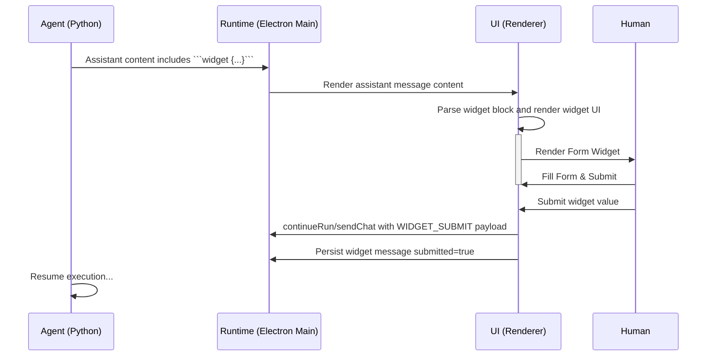

# Tech Spec: Story 5-12 – Interactive Embedded Widgets

## Summary
Implement a **Widget Protocol** and component system to support structured, interactive UI elements (Forms, Selection, Plan Reviews, etc.) within the chat stream.

## Implementation Note (This Iteration)
- Widget requests are delivered via **structured assistant message blocks**: ` ```widget\n{...}\n``` ` (parsed in the renderer).
- Widget submission is sent back to Runtime as a **user message** (`WIDGET_SUBMIT\n{...}`), and the widget message is persisted via `updateConversationMessage()`.
- Added `ui.ask_user` tool schema: Runtime validates widget payload and returns a `widgetBlock` snippet for the assistant to render.
- Dedicated `widget:request` / `widget:submit` IPC events and backend tool waiting/resume are deferred to a future backend story.

---

## 1. Widget Protocol & Data Model

### 1.1 Extended Message Type
Following `ConversationMessage` in `appStore.ts` (extended by Story 5-11), we add an optional `widget` payload.

```typescript
export type WidgetType = 'form' | 'selection' | 'confirmation' | 'plan_review' | 'feedback' | 'action_selection'

export interface WidgetOption {
  value: string
  label: string
  description?: string
}

export interface WidgetPayload {
  widgetId: string
  type: WidgetType
  message: string // Heading/Instruction for the user
  submitted: boolean
  
  // Type-specific payloads (can be union types in implementation)
  schema?: object           // Form: JSON Schema
  options?: WidgetOption[]  // Selection
  multi?: boolean           // Selection
  planContent?: string      // PlanReview: Markdown string
  items?: Array<{ id: string; content: string }> // Feedback
  actions?: Array<{ id: string; label: string; description?: string }> // ActionSelection
  
  // Submission
  submittedValue?: unknown  
}

export interface ConversationMessage {
  // ... existing fields ...
  widget?: WidgetPayload
}
```

### 1.2 IPC Events for Widgets (Future)

| Event | Direction | Description | Payload |
|---|---|---|---|
| `widget:request` | Main → Rend | Agent wants to show a widget | `WidgetPayload` (usually embedded in `llm:stream-chunk` or tool result) |
| `widget:submit` | Rend → Main | User submits widget data | `{ widgetId: string, value: unknown }` |

---

## 2. Component Architecture

All widgets reside in `crewagent-runtime/src/pages/RunsPage/components/widgets/`.

### 2.1 `WidgetRegistry.tsx`
Factory component that takes `WidgetPayload` and renders the correct specific widget component. It also handles the "Read-Only" state wrapper if `submitted === true`.

```tsx
export function WidgetRegistry({ widget, onSubmit }: Props) {
  const Component = MAP[widget.type]
  if (!Component) return <ErrorWidget message="Unknown widget type" />
  
  return (
    <div className={`widget-container ${widget.submitted ? 'submitted' : 'active'}`}>
       <Component payload={widget} onSubmit={onSubmit} disabled={widget.submitted} />
    </div>
  )
}
```

### 2.2 Specific Components

#### A. `FormWidget.tsx`
- **Props**: `schema`, `disabled`, `onSubmit`
- **Lib**: lightweight Schema-to-Form mapper (no new deps).
- **UI**: Renders inputs based on schema properties. Validates `required` fields before submit.

#### B. `SelectionWidget.tsx`
- **Props**: `options`, `multi`, `disabled`, `onSubmit`
- **UI**: List of Checkboxes (multi) or Radio buttons (single).
- **Output**: Array of strings (always).

#### C. `PlanReviewWidget.tsx`
- **Props**: `planContent`, `disabled`, `onSubmit`
- **UI**:
    - Renders `planContent` using `MessageMarkdown`.
    - Buttons: `Approve` (Green), `Request Changes` (Red).
    - If "Request Changes" clicked: Show textarea for feedback.
- **Output**: `{ decision: 'approve' }` OR `{ decision: 'request_changes', feedback: string }`.

#### D. `FeedbackWidget.tsx`
- **Props**: `items`, `disabled`, `onSubmit`
- **UI**: 
    - Loop through `items`.
    - Each item: Card with content + `<textarea>` input.
- **Output**: `{ [itemId]: string }` (map of feedback text).

#### E. `ActionSelectionWidget.tsx`
- **Props**: `actions`, `disabled`, `onSubmit`
- **UI**: Radio list of actions. Primary "Continue" button.
- **Output**: Selected `actionId`.

#### F. `ConfirmationWidget.tsx`
- **Props**: `disabled`, `onSubmit`
- **UI**: Confirm / Cancel buttons.
- **Output**: `{ confirmed: boolean }`.

---

## 3. Integration Logic

### 3.1 Persistence & State
- **Storage**: Widget state (`submitted`, `submittedValue`) must be persisted in `messages.json`.
- **Handling Updates**: When `onSubmit` is called:
    1. Update message `widget.submitted=true` and store `submittedValue` via `updateConversationMessage()`.
    2. Append a user message `WIDGET_SUBMIT\n{...}` and route it through existing `sendChat` / `continueRun` flows.

### 3.2 Trigger Mechanism (This Iteration)
- The assistant response can embed one or more ` ```widget` JSON blocks.
- Renderer parses them into separate assistant messages with `message.widget` populated.
- **System Prompt Rule (NEW)**: 当需要结构化输入时，助手必须调用 `ui.ask_user`（Runtime 会校验并返回 `widgetBlock`），并输出 ` ```widget` JSON 块；禁止用纯文本模拟表单。

### 3.3 In-Chat Embedding (NEW)
- Widget UI must render **inline within the chat message stream** (MessageList/MessageItem), embedded in the same bubble area as the assistant message that triggered it.
- **Do not** render widgets in a separate panel, modal, or sidebar; the widget is part of the conversation flow.

### 3.4 Interaction Flow Diagram



---

## 4. Verification Plan

### 4.1 Unit Tests
- `FormWidget`: Validate schema constraints (e.g. required fields).
- `SelectionWidget`: Test single vs multi logic.
- `PlanReviewWidget`: Test transitions between View -> Approve and View -> Request Changes.
- `WidgetRegistry`: Test rendering correct component and read-only state.

### 4.2 Manual Verification
1. **Mock Trigger**: Manually inject a message with `widget` payload into `messages` state.
2. **Interact**: Fill out form / select items.
3. **Submit**: Click submit. Verify `onSubmit` callback is fired with correct JSON.
4. **Read-Only**: Verify UI disables inputs after submission.
5. **Persistence**: Reload app, ensure widget remains in submitted state.
