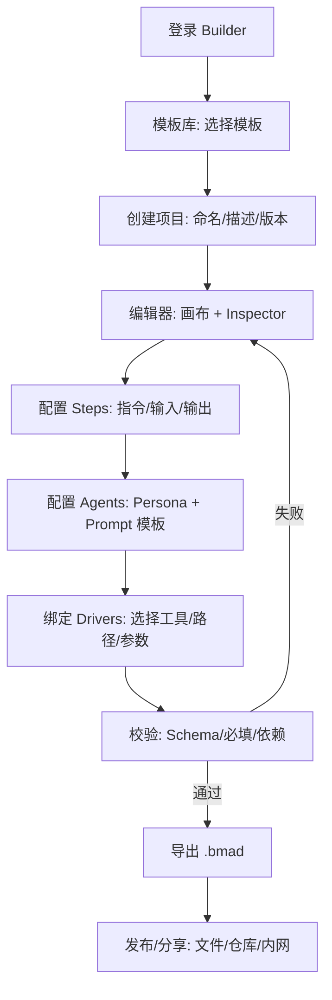
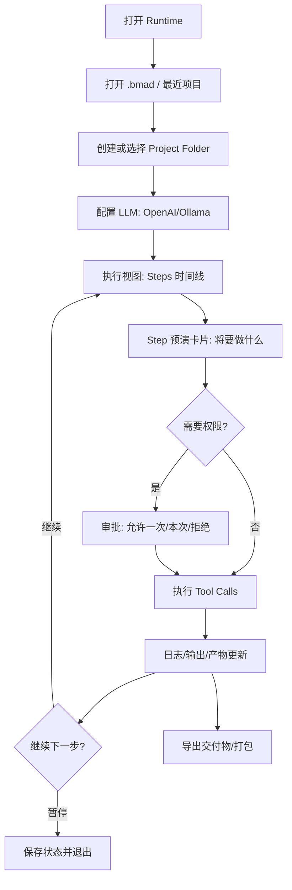
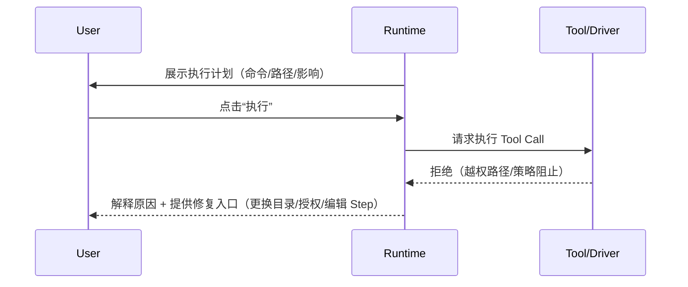

# UX Design Specification - CrewAgent

**Author:** Mengbin  
**Date:** 2025-12-21

> 目标：为 CrewAgent（Builder Web + Runtime Desktop）提供可执行的 UX 规格，用于指导信息架构、交互模式、组件策略与可访问性要求。  
> MVP 重点：Template-first、线性流程（Linear flows）、本地优先（Local-first）、可解释与可控（Explain + Approve）。

---

## Executive Summary

### Project Vision

CrewAgent 是一个“行业通用 Agent OS / Meta-BMAD”：

- **Builder（云端/网页）**：面向 Creator（如 Simin）的可视化定义平台，用模板驱动的方式定义 Workflow + Agent Persona，并导出 `.bmad` 包。
- **Runtime（本地/桌面）**：面向 Consumer（如 David）的执行客户端，加载 `.bmad`，连接用户的 LLM（OpenAI / Ollama / LM Studio），通过 MCP 驱动本地工具（文件系统、终端、未来 CAD/ERP），并将产物统一写入“受控项目目录”。

UX 的关键是：把复杂的“AI + 工具编排”变成**可理解、可预期、可回滚/可恢复**的工作流体验，避免“视觉面条化”和“黑箱自动化”带来的不信任。

### Target Users

**Primary**

- **Creator / Implementation Engineer（Simin）**：懂业务、会工具、希望 1 周内做出可用行业包；需要从模板开始快速改造、配置 Driver、发布 `.bmad`。
- **Consumer / Engineer（David）**：执行项目的人；需要在“离线/受限环境”下，用最少输入完成标准化流程，并保证文档与计算结果一致。

**Secondary**

- **Domain Expert（Chief Wang）**：提供知识与标准，不直接使用产品；其关注点是“标准被贯彻、可追溯、可验证”。
- **IT / Admin**：关心离线部署、权限、沙箱、审计与可控升级。

### Key Design Challenges

1. **模板优先 vs 自由度**：既要给新手一条“可走通”的路，又要允许专家局部深改。
2. **信任与安全**：LLM 不是可执行引擎的绝对真理；必须提供“可解释 + 可审批 + 可验证”的交互闭环。
3. **双端体验一致性**：Builder（定义）与 Runtime（执行）必须共享同一套心智模型：Package / Workflow / Step / Agent / Artifact / Project Folder。
4. **本地优先与企业限制**：离线、代理、权限、路径（Windows 优先）都要在 UX 中显性化。
5. **复杂信息呈现**：图编辑（React Flow）、配置表单、日志/工具输出、文件产物，都需要低认知负担的组织方式。

### Design Opportunities

- **Template-first 启动**：模板库 + 引导式创建 + 预接线“Guardrail Nodes”（校验/确认/回滚）。
- **Explain-Plan-Approve**：任何对本地工具/文件的动作都能先“预演/说明”，再执行，并保留审计。
- **Document-as-State 可视化**：将 `stepsCompleted` 等状态以时间线/进度条可视呈现，便于暂停与恢复。
- **安全沙箱体验**：让“路径限制”不再是报错信息，而是一个可理解的权限边界 UI（允许列表、受控选择器、提示）。

---

## Core User Experience

### Defining Experience（定义型体验）

CrewAgent 的“定义体验”由两个子核心构成：

1. **Creator：从模板出发 → 3 分钟看到可运行的流程**
2. **Consumer：加载包 → 逐步执行 → 随时接管 → 产物一致**

> 如果只把一个交互做好：**“模板启动 + 安全执行（可解释/可审批/可恢复）”**。

### Platform Strategy

- **Builder（Web）**：桌面端浏览器为主（工程场景），移动端仅保证可读与基础管理。
- **Runtime（Desktop）**：Windows 优先；窗口可缩放；键盘操作完整；离线可用。

### Effortless Interactions（需要做到“零思考”的动作）

**Creator（Builder）**

- 通过“模板库”一键创建工程包（项目向导：名称 → 模板 → 完成）。
- 在画布上“新增 Step/连接 Step/编辑属性”时，右侧 Inspector 即时呈现可理解的表单（避免 Markdown/JSON 暴露）。
- 导出 `.bmad` 时自动运行校验（Schema、必填项、依赖、版本），并以“可操作的错误提示”引导修复。

**Consumer（Runtime）**

- “打开包 → 创建/选择项目目录 → 运行”三步即可进入执行。
- 每一步执行前：清晰展示**将要做什么**（工具、命令、读写文件、预计产物），支持“一次允许 / 本次允许 / 拒绝”。
- 执行中可随时暂停，重启后自动从上次 Frontmatter 状态恢复，并给出“恢复原因说明”。

### Critical Success Moments（成败时刻）

- Creator 第一次导出 `.bmad` 并在 Runtime 成功跑通（首次闭环）。
- Consumer 第一次看到“产物一致性”带来的收益：计算结果与报告自动同步、可追溯。
- 第一次遇到风险动作（越权路径/危险命令）时，系统阻止并解释原因（建立信任）。

### Experience Principles（体验原则）

1. **Template-first**：空白画布不是起点，模板与引导才是。
2. **Explain before Execute**：先解释/预览，再执行。
3. **Local-first & Offline-ready**：离线不降级为“不可用”，而是可运行的默认态。
4. **Progressive Disclosure**：新手只见必要项，专家可展开高级项。
5. **State is Visible**：状态永远可见、可定位、可恢复。
6. **Safety by Default**：默认最小权限；越权路径必须显式授权。

---

## Desired Emotional Response

### Primary Emotional Goals

- **掌控感**：用户始终知道系统在做什么、为什么这样做、会影响哪些文件。
- **可信赖**：面对“高精度工程”场景，产品以“可验证、可审计、可回滚”的方式建立信任。
- **效率与轻松**：减少“搬运数据”的疲劳感，让用户把注意力回到工程判断本身。

### Emotional Journey Mapping

- 初次进入：从“担心 AI 乱动我文件” → “有明确权限边界与预览”。
- 执行过程：从“黑箱不确定” → “可解释 + 可追踪 + 可暂停”。
- 完成交付：从“版本混乱焦虑” → “产物一致与可追溯的安心”。

### Micro-Emotions

- 信心（Confidence）↑：每一步有清晰反馈与结果。
- 焦虑（Anxiety）↓：危险动作前置拦截、提示可理解。
- 成就感（Accomplishment）↑：可视化进度 + 明确产物列表。

### Design Implications

- 强化“预演卡片”：命令/文件写入/输出预览（含 diff）。
- 提供“撤销/回滚”叙事：至少做到“恢复到上一步”与“重跑该步”。
- 错误信息必须包含：**发生了什么**、**为什么**、**你能怎么做**。

---

## UX Pattern Analysis & Inspiration

### Inspiring Products Analysis

- **Figma**：画布 + Inspector 的组合能承载复杂对象编辑（适配 Workflow/Node 编辑）。
- **VS Code**：命令面板、面包屑、终端输出的“工具化可读性”（适配 Runtime 日志/工具调用）。
- **Notion / Linear**：信息结构清晰、轻量而不失专业（适配模板库与项目管理）。
- **GitHub Actions**：执行日志与步骤可追踪（适配 Workflow 执行视图）。
- **Docker Desktop**：本地能力的可视化管理（适配 Drivers/沙箱/资源管理）。

### Transferable UX Patterns

- 左侧导航（Projects/Packages/Settings）+ 主内容 + 右侧 Inspector（属性编辑）
- “时间线/步骤条”驱动的执行视图
- Command Palette（快速搜索：打开项目、运行、查看日志、切换驱动）
- 结构化日志（按 step/tool 分组），支持复制/导出

### Anti-Patterns to Avoid

- 纯空白画布（无模板/无引导）导致“视觉面条化”。
- 黑箱自动化：不解释、不可审计、不可撤销。
- 以技术概念命名 UI（如“stdio MCP”直接暴露）导致学习成本高。

### Design Inspiration Strategy

- Builder：借鉴 Figma 的“画布为中心 + Inspector 为编辑中心”，并把复杂度放进模板与 Guardrails。
- Runtime：借鉴 GitHub Actions 的“步骤/日志/产物”三联视图；借鉴 Docker Desktop 的“本地能力与权限”管理。

---

## Design System Foundation

### 1.1 Design System Choice

**建议选择：Tailwind CSS + shadcn/ui（Radix UI）+ Lucide Icons**

- Builder（Next.js + Tailwind）与 Runtime（Electron + React + Tailwind）可以共用组件范式与 Token。
- Radix 提供较好的可访问性基础（focus、aria、keyboard），降低工程风险。
- 与“模板优先”理念兼容：组件是底座，模板是体验加速器。

### Rationale for Selection

- 兼顾速度与可定制：比纯自研更快、比重型大而全 UI 框架更可控。
- 可同时支持“专业工程工具的密度”和“新手友好”的渐进呈现。

### Implementation Approach

- 统一 Token：颜色、间距、字体、阴影、圆角、动效时长。
- 统一交互组件：Dialog、Drawer、Toast、Tabs、DataTable、Command Palette。
- Graph 组件：React Flow（xyflow），并为 Node/Edge 样式提供 Token 化支持。

### Customization Strategy

- 通过 CSS Variables 实现 Light/Dark + 多主题切换（参考：`_bmad-output/ux-color-themes.html`）。
- 为企业部署提供“高对比度主题”和“禁用动效”选项。

---

## Defining Experience（核心交互细化）

### 2.1 Defining Experience

**核心交互定义：**

- **Creator**：用模板创建一个“可运行的线性工作流”，通过图 + 表单完成“步骤编排与工具绑定”，一键导出 `.bmad`。
- **Consumer**：在 Runtime 中以“受控、可审计”的方式运行工作流：输入参数 → 执行本地工具 → 写入项目目录 → 生成并导出一致的交付物。

### 2.2 User Mental Model

- 用户把系统理解为“带着流程的专家助手”，而不是“自动化脚本黑盒”：
  - 他们期待“下一步该做什么”的引导，而不是把所有选择一次性塞给他们。
  - 他们希望“我能随时接管”，并且系统不会越权修改不该改的文件。

### 2.3 Success Criteria

- 10 分钟内跑通第一个模板（MVP）。
- 任何本地命令/文件写入都可追踪到：Step → Tool Call → 输出 → 产物。
- 发生错误时，用户能在 1 分钟内知道“怎么修/怎么继续”。

### 2.4 Novel UX Patterns

- **Explain-Plan-Approve**（新模式）：将工具调用变成可理解的“执行计划卡片”。
- **Document-as-State 可视化**：把 Frontmatter 状态从“文件头部”提升为 Runtime 的主进度。

### 2.5 Experience Mechanics（以 Consumer 执行为例）

1. 入口：打开包/最近项目 → 选择项目目录（或自动创建）
2. 预演：展示本步将调用的 tool、读写路径、预期产物
3. 审批：一次允许 / 本次允许 / 拒绝（可配置默认策略）
4. 执行：实时输出 + 可中断
5. 完成：产物列表更新 + `stepsCompleted` 更新 + 可导出

---

## Visual Design Foundation

### Color System

- 建议以“专业工具感 + 高对比可读性”为主：中性背景 + 清晰语义色（success/warning/error）。
- 提供 Light/Dark 双模式；Dark 对工程用户（长时间使用）更友好。
- 主题可视化参考：`_bmad-output/ux-color-themes.html`

**语义色建议：**

- Primary：品牌主色（用于主按钮、关键高亮）
- Secondary：辅助强调（次按钮/Tag）
- Success / Warning / Error / Info：用于状态与反馈
- Surface/Border：结构层次，避免“全靠阴影”

### Typography System

- 字体：优先系统字体（Windows：Segoe UI；macOS：SF/PingFang；Linux：Noto Sans）
- 中文优先：`PingFang SC / Microsoft YaHei / Noto Sans CJK`
- 字号：以可读性为主，正文建议 14–16px（可配置“密度模式”）

### Spacing & Layout Foundation

- 间距基准：4px；常用 spacing：4/8/12/16/24/32
- Builder Editor 默认三栏：
  - 左：Palette / Outline（240px）
  - 中：Canvas
  - 右：Inspector（360–420px，可收起）
- Runtime 默认两栏：
  - 左：Projects/Packages（240px，可收起）
  - 中：Step/Log/Artifacts Tabs

### Accessibility Considerations

- Builder 目标：WCAG 2.1 AA
- 关键要求：
  - 文字对比度 ≥ 4.5:1
  - 全键盘可操作（Tab/Shift+Tab、Esc 关闭、Enter 确认）
  - 清晰 focus ring
  - 所有图标按钮具备 aria-label

---

## Design Direction Decision

### Design Directions Explored

已生成 6 种方向的可视化草图（用于讨论与对齐）：`_bmad-output/ux-design-directions.html`

1. Workbench（IDE 风格，密度高）
2. Template-first（卡片式引导，友好上手）
3. Enterprise（保守、极清晰、审计优先）
4. Canvas-first（画布最大化）
5. Command-centric（命令面板驱动）
6. Document-centric（文档/状态为中心）

### Chosen Direction（建议默认）

**“Template-first 进入 + Workbench 执行/编辑”混合方向**

- 首页与新建流程：Template-first，降低上手成本。
- 编辑器与执行器：Workbench，适配工程工具心智与高密度信息呈现。

### Design Rationale

- 工程场景的“效率与控制”优先，但不能牺牲首次使用门槛。
- 混合方向能够同时满足新手与专家，且利于渐进披露（Progressive Disclosure）。

### Implementation Approach

- 共用布局骨架（Header + LeftNav + Main + Inspector/Drawer）
- 主题与密度模式可切换（Comfort / Compact）

---

## User Journey Flows

### Journey 1（Creator）：从模板到发布 `.bmad`

### Journey 2（Consumer）：加载包并安全执行

### Journey 3（安全边界）：越权与高风险操作

### Journey Patterns

- 任何“执行”都先“预演”，并把“影响范围”讲清楚。
- 任何“失败”都提供可操作的下一步（修复/重试/跳过/编辑配置）。

### Flow Optimization Principles

- 让用户尽快看到“可运行”：模板 + 默认配置 + 智能提示。
- 把复杂配置放进“高级折叠区”，保持主路径简洁。

---

## Component Strategy

### Design System Components（可直接复用）

- Button, Input, Select, Checkbox, Switch
- Dialog/Drawer, Tabs, Tooltip, Toast
- DataTable, DropdownMenu, Command Palette
- Badge/Tag, Alert, Progress, Skeleton

### Custom Components（需定制）

#### Workflow Canvas（Builder）

- **Purpose**：承载 Step/Agent/Guardrail 的图形编排（React Flow）。
- **States**：只读预览 / 可编辑；校验错误高亮；缩放/对齐辅助线。
- **Accessibility**：至少提供键盘选择节点、打开 Inspector 的能力；画布层的完全无障碍可作为后续增强。

#### Inspector Panel（Builder/Runtime）

- **Purpose**：右侧属性编辑（Step 配置、Agent Persona、Driver 绑定、权限策略）。
- **Key**：表单分组 + 必填提示 + 即时校验 + “为什么需要这个”说明。

#### Execution Timeline（Runtime）

- **Purpose**：步骤进度与状态（pending/running/done/error/paused）。
- **Behavior**：点击切换步骤详情；错误步骤固定可见；支持“重跑该步/跳过（策略允许时）”。

#### Tool Call Approval Dialog（Runtime）

- **Purpose**：将 Tool Call 变为“人类可读”的计划，提供审批与策略保存。
- **Must-have**：命令预览、路径范围、输出捕获说明、风险提示、diff（如写文件）。

#### Log Viewer（Runtime）

- **Purpose**：按 Step/Tool 分组的结构化日志。
- **Behavior**：复制、导出、过滤（stderr only）、时间戳、折叠。

### Component Implementation Strategy

- Builder 与 Runtime 共享组件规范与 Token，但允许布局密度不同（Compact/Comfort）。
- 高风险组件（审批、权限、删除）统一使用“危险确认”模式（双确认或输入确认）。

### Implementation Roadmap（MVP 优先级）

1. Template Library + Project Wizard（Builder）
2. Editor：Canvas + Inspector（线性流程 MVP）
3. Export `.bmad` + 校验（Builder）
4. Runtime：打开包 + Project Folder + 执行视图（Steps/Logs/Artifacts）
5. Tool Call 审批与沙箱 UI（Runtime）

---

## UX Consistency Patterns

### Button Hierarchy

- **Primary**：每屏最多一个；用于“创建/导出/执行/保存”。
- **Secondary**：次要动作（预览、测试、打开日志）。
- **Tertiary/Link**：低风险动作（了解更多）。
- **Danger**：删除/清空/越权授权；必须二次确认。

### Feedback Patterns

- Toast：用于成功/轻量提示（可撤销时优先提供 Undo）。
- Inline Alert：用于阻塞错误（校验失败、权限拒绝）。
- Progress：长任务展示进度（至少展示“正在做什么 + 可取消”）。

### Form Patterns

- 必填项明确标识；错误提示紧邻字段并说明修复方式。
- Driver 路径使用文件选择器而非纯输入框（减少错误）。

### Navigation Patterns

- Builder：Dashboard / Templates / Projects / Settings
- Runtime：Projects / Packages / Drivers / Settings / Logs（可按产品最终形态合并）

### Additional Patterns

- Empty State：给“下一步行动”（创建项目/导入包/配置 LLM）。
- Permission：允许策略可落盘（仅限当前项目/全局），并可回看与撤销。

---

## Responsive Design & Accessibility

### Responsive Strategy

- Builder：桌面优先（≥ 1024px）；小屏只保证可读与基础管理，不强制支持完整编辑体验（可显示提示）。
- Runtime：窗口可缩放；关键面板（Inspector/Logs）可折叠为 Drawer。

### Breakpoint Strategy

- 1280+：三栏（Palette + Canvas + Inspector）
- 1024–1279：两栏（Canvas + Inspector 折叠）
- <1024：只读预览/限制编辑（MVP）

### Accessibility Strategy

- Builder：WCAG 2.1 AA（建议）
- Runtime：键盘可达 + 结构化焦点管理 + 高对比主题（建议）

### Testing Strategy

- 自动化：Playwright + axe（Builder）；关键交互（审批弹窗、日志过滤、模板创建）覆盖 e2e。
- 人工：键盘导航、对比度检查、色盲模拟；Windows 高对比模式下可读性检查。

### Implementation Guidelines

- 语义化 HTML + ARIA（尤其是 IconButton、Dialog、Tabs、Command Palette）
- 统一 focus ring；禁用“只有颜色区分状态”的设计
- 所有危险操作提供“撤销/回滚/二次确认”

---

## Deliverables

- UX 规格：`_bmad-output/ux-design-specification.md`
- 主题预览：`_bmad-output/ux-color-themes.html`
- 方向草图：`_bmad-output/ux-design-directions.html`
